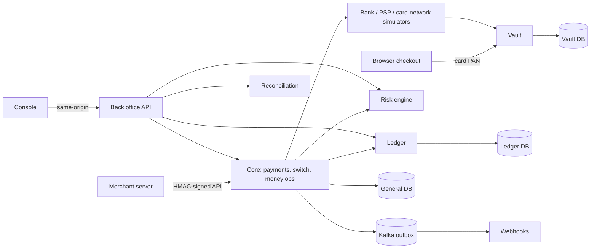

# Tally

Tally is a ledger-backed payments platform built as a **synthetic simulation**: a UPI-style switch
and card flow, a double-entry ledger with a tamper-evident hash chain, refunds, disputes,
settlement and payouts, three-way reconciliation, a real-time risk engine, a merchant and
operations console, and the deployment, observability and failure testing around them.

It does not move real money, accept real card data, or connect to real banks, NPCI or card
networks; every counterparty is a simulator. It is not PCI DSS or RBI certified and makes no
claim of production readiness.

## Try it

Requirements: Docker (Compose v2), Python 3.12 with [uv](https://docs.astral.sh/uv/), Node 22.

```bash
make demo
```

This starts the dependencies, every service with seeded data, and the console, then runs a guided
tour that prints what happens at each step:

1. a signed UPI payment and the double-entry ledger lines it produced;
2. an idempotent retry (same answer, one payment) and a refused key reuse;
3. a card tokenised in the "browser" at the vault, authorised, captured;
4. a partial refund and a refused over-refund;
5. a large transfer held by the risk engine and approved by an analyst;
6. a bank outage: the payment's outcome becomes unknown and the recovery worker resolves it;
7. the ledger's integrity verifier and a balanced trial balance.

Afterwards open <http://localhost:3000> (merchant `admin@demo.test`, operations `ops@tally.test`;
every demo user's password is `correct horse battery staple`). `make demo-stop` ends it.

To test it properly, follow the [testing guide](docs/testing-guide.md): what to click, what
should happen, the behaviours that surprise people, and
`uv run python -m scripts.edge_cases`, which drives 26 failure modes and edge cases through the
real services and checks each payment's final state and ledger effect. A presenter's
walkthrough is in [docs/demo-script.md](docs/demo-script.md).

## Highlights

| What | Evidence |
| --- | --- |
| Exact money: integer minor units, Decimal half-even rounding, largest-remainder splits; floats are banned from money code by an AST check in CI | [ADR-001](docs/adr/ADR-001-money.md), `libs/money` |
| Append-only double-entry ledger in PostgreSQL: balanced entries, holds, idempotent posting by key and payload, SHA-256 hash chain, continuous integrity verifier | [ledger design](docs/ledger-design.md) |
| Every payment step is crash-safe: state change, outbox event and ledger command commit together; deterministic keys make every retry exactly-once in effect | [guarantees](docs/guarantees.md) |
| **100,000** seeded end-to-end chaos scenarios (crashes at every step boundary, lost responses, duplicates, late bank truth) pass with an independent money checker | [chaos report](docs/chaos-report.md) |
| On a live Kubernetes cluster under load: pods killed, PostgreSQL crashed, core partitioned from the ledger, then a money audit with **0 problems** | [chaos report](docs/chaos-report.md#on-cluster-chaos-phase-15) |
| Reconciliation found **100%** of 17,280 planted breaks across three bank-file formats; a 1M-transaction day reconciles in 6 s | [recon report](docs/recon-report.md) |
| Risk engine: rules DSL plus a LightGBM model served with ONNX, reason codes from SHAP, p99 ≈ 10 ms in-process; PR-AUC 0.888 on synthetic data | [model card](docs/risk-model-card.md) |
| Security: HMAC-signed merchant API, MFA, rotating refresh tokens with reuse detection, deny-by-default RBAC, row-level tenant isolation, maker-checker, hash-chained audit log | [security](docs/security.md), [threat model](docs/threat-model.md) |
| Canary releases gated on the ledger's integrity: a broken release was aborted automatically in 71 s while the stable version kept serving | [drill report](docs/k8s-drill-report.md) |
| Load: ~120 payments/s sustained (p99 424 ms) on a laptop; the limit is understood and measured | [load-test report](docs/load-test-report.md) |
| Backup and point-in-time restore of the ledger: RPO 46 s, restored data hash-identical | [backup report](docs/backup-restore-report.md) |

Testing found and fixed real defects along the way; [docs/highlights.md](docs/highlights.md)
lists the most instructive ones.

## Architecture



The ledger and the vault each have their own database; the core never edits balances, it asks
the ledger to post. Full diagrams, the payment sequence and trust boundaries are in
[docs/architecture.md](docs/architecture.md).

## Repository

| Path | Contents |
| --- | --- |
| `services/` | core (payments, switch, refunds, settlement, disputes, webhooks), ledger, vault, risk, recon, back office API, workers, simulators |
| `libs/` | money, security (HMAC, JWT, TOTP, SSRF-safe HTTP), idempotency, observability, admission control |
| `web/console` | Next.js console: merchant area, operations area, hosted checkout, payer phone |
| `ml/` | synthetic fraud data, training, retraining and the committed model |
| `chaos/` | ledger and full-flow failure-injection harnesses |
| `infra/` | Helm chart, Argo CD, Kyverno, Terraform for AWS, observability stack |
| `deploy/docker` | container images |
| `loadtest/` | k6 scripts |
| `scripts/` | dev stack, demo, drills (alerts, canary, cluster chaos, backup), load runner, checks |
| `tests/` | unit, property, integration, security; Playwright end-to-end tests live in `web/console/e2e` |
| `docs/` | architecture, guarantees, ADRs, reports, runbooks, progress |

## Checks

| Command | What it runs |
| --- | --- |
| `make lint` / `make test` | Ruff, strict mypy, the money float-ban; unit and property tests |
| `make stack-test-integration` | money movement, crash replay, reconciliation, risk and security suites on fresh databases |
| `make e2e` | Playwright tests against the running stack, with accessibility scans |
| `make chaos` / `make chaos-100k` | ledger chaos; 100,000 full-flow scenarios in parallel shards |
| `make infra-check` | Helm render, kubeconform, Kyverno, Terraform validate, Trivy, Checkov |
| `make security-scan` | gitleaks, Semgrep, pip-audit, npm audit, Trivy images, SBOMs |
| `make k8s-up`, `make k8s-drill`, `make cluster-chaos`, `make loadtest` | the chart on a local minikube profile: canary drill, chaos under load, load tests |
| `make backup-drill`, `make alert-drill` | ledger restore and PITR; induced failures that must fire alerts |

## Documentation

- [Testing guide](docs/testing-guide.md): how to test every flow and edge case
- [Architecture](docs/architecture.md), [guarantees](docs/guarantees.md), [ledger design](docs/ledger-design.md), [APIs](docs/api.md)
- Decisions: [docs/adr](docs/adr) (ADR-001 to ADR-019)
- Reports: [chaos](docs/chaos-report.md), [reconciliation](docs/recon-report.md), [risk model](docs/risk-model-card.md), [load test](docs/load-test-report.md), [backup/restore](docs/backup-restore-report.md), [canary drill](docs/k8s-drill-report.md)
- Operations: [observability](docs/observability.md), [SLOs](docs/slo.md), [runbooks](docs/runbooks), [deployment](docs/deployment.md), [cost](docs/cost.md)
- Security and compliance: [security](docs/security.md), [threat model](docs/threat-model.md), [compliance mapping](docs/compliance-mapping.md), [SECURITY.md](SECURITY.md)
- Status, verified results and known gaps: [docs/PROGRESS.md](docs/PROGRESS.md)

## Limits worth knowing

- **Simulation only.** Bank, PSP and card-network messages are simplified illustrations of public
  concepts, not NPCI or card-scheme protocols. Risk metrics come from synthetic data.
- **Not deployed to AWS.** The Terraform and Helm code is validated, scanned and exercised on a
  local cluster; it has never been applied to a cloud account.
- **Throughput:** about 120 payments/s on the test laptop against a 300/s goal. The single ledger
  hash chain serialises postings; partitioned chains are the documented next step.
- More in [PROGRESS](docs/PROGRESS.md#known-gaps).

## Safety

Use synthetic data only. Never put secrets, real cardholder data or production credentials in
this repository. Report security issues as described in [SECURITY.md](SECURITY.md).
