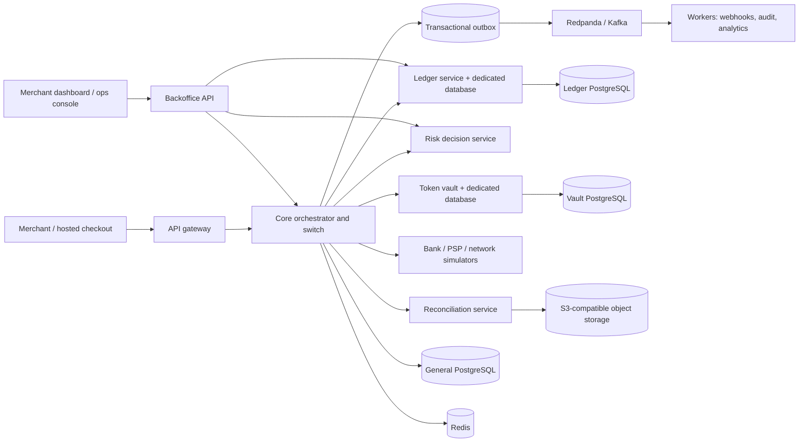

# Tally architecture

The local payment API, ledger API, vault API, and configurable bank, payer PSP, and card-network simulators are implemented. Payments use card tokens or the simplified UPI flow; the core persists state transitions, ledger commands, outbox events, and recovery schedules. A worker checks UPI bank outcomes and records late-success corrections. Risk, recon, backoffice, web apps, webhook dispatch, and analytics workers remain target components.

## Service boundaries

The ledger and vault have separate databases. The core coordinates workflows and persists payment state but never edits ledger balances. It creates deterministic merchant liability accounts through the ledger API and submits idempotent holds or postings. A state transition, immutable transition-log row, outbox event, and any required ledger command are stored in one general-database transaction. External calls happen after that transaction; recovery leases and deterministic keys let a worker resume UPI switch commands after a crash.

UPI VPA routing in this local version reads the bank ID registered for each VPA. Bank recovery policy is snapshotted from a bank and amount-tier table when an outcome becomes unknown. Messages and responses are simplified examples of publicly documented UPI concepts; they are not the NPCI protocol or its message formats. Alternate-bank failover and card-network outcome recovery are not implemented.

## Local dependencies

`docker compose up -d --wait` starts three PostgreSQL instances (general, ledger, vault), Redis 7, Redpanda, and SeaweedFS with its S3 endpoint. Credentials in Compose are local development values only and must never be reused outside local simulation.
