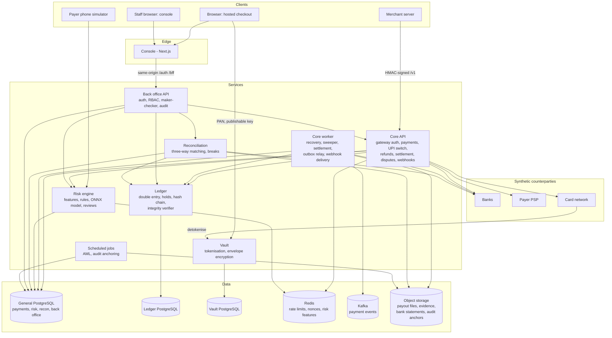
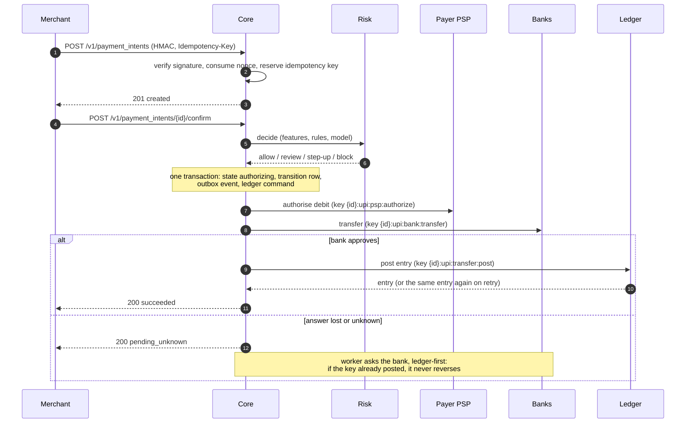

# Architecture

Tally is a set of small services around one rule: **money exists only in the ledger, and the
ledger only changes through balanced, idempotent, append-only entries.** Everything else
(payment state, risk decisions, reconciliation) is about deciding which entries to post, and
proving afterwards that the right ones were.

## System

| Service | Owns | Never does |
| --- | --- | --- |
| Core API and worker | payment intents, state machine, transition log, outbox, ledger *commands*, refunds, settlements, payouts, disputes, webhooks | edit balances; it asks the ledger to post by deterministic key |
| Ledger | accounts, journal entries, postings, holds, balances, hash chain | accept an unbalanced, duplicate-with-different-payload, or retroactive change |
| Vault | encrypted PANs (envelope encryption) and tokens | return a PAN to anyone but the card-network simulator |
| Risk | features, rule versions, model registry, decisions, review cases | move money; it only allows, reviews, steps up or blocks |
| Reconciliation | bank statements, matches, breaks, proposed adjustments | post without maker-checker approval |
| Back office API | staff identities, sessions, roles, approvals, audit log | let a user approve their own request |

## A UPI payment

Card payments follow the same pattern with a ledger **hold** placed at authorisation and posted
or voided at capture or cancel. Crash windows and their recovery are listed in
[guarantees](guarantees.md#crash-windows-orchestrator-process-killed-between-durable-effects).

## Trust boundaries

1. **Internet → merchant API:** HMAC over method, path, body hash, timestamp and nonce; scopes;
   per-merchant rate limits; idempotency; admission control under overload.
2. **Browser → vault:** publishable key, CORS, published test cards only; the merchant server and
   core only ever see tokens.
3. **Staff → back office:** password + TOTP, short-lived ES256 JWTs with rotating refresh tokens,
   CSRF, deny-by-default RBAC, maker-checker for money-moving actions, hash-chained audit log.
4. **Service → service:** internal keys per caller; in Kubernetes, default-deny NetworkPolicies
   allow only the declared paths.
5. **Application → data:** separate databases for the ledger and the vault; the ledger's
   application role can only call its stored functions; merchant users are confined by
   PostgreSQL row-level security.

## Deployment

Locally everything runs from `make demo` (Compose dependencies plus the services in one process)
or on a local Kubernetes cluster (`make k8s-up`). For AWS the repository contains, validated but
not applied: one image per runtime, a Helm chart with Argo Rollouts canaries gated on ledger
integrity, Argo CD applications, Kyverno admission policies, and Terraform for EKS, three RDS
instances, ElastiCache, MSK, S3 with Object Lock, KMS and WAF in Mumbai with Hyderabad DR copies.
See [deployment](deployment.md) and [ADR-019](adr/ADR-019-deployment.md).

## Observability

Every service exports Prometheus RED metrics and domain metrics (payments by state, oldest unknown
outcome, ledger integrity, recon match rate, risk latency and drift), OpenTelemetry traces and
redacted JSON logs. Alert rules, dashboards and runbooks are in [observability](observability.md).
