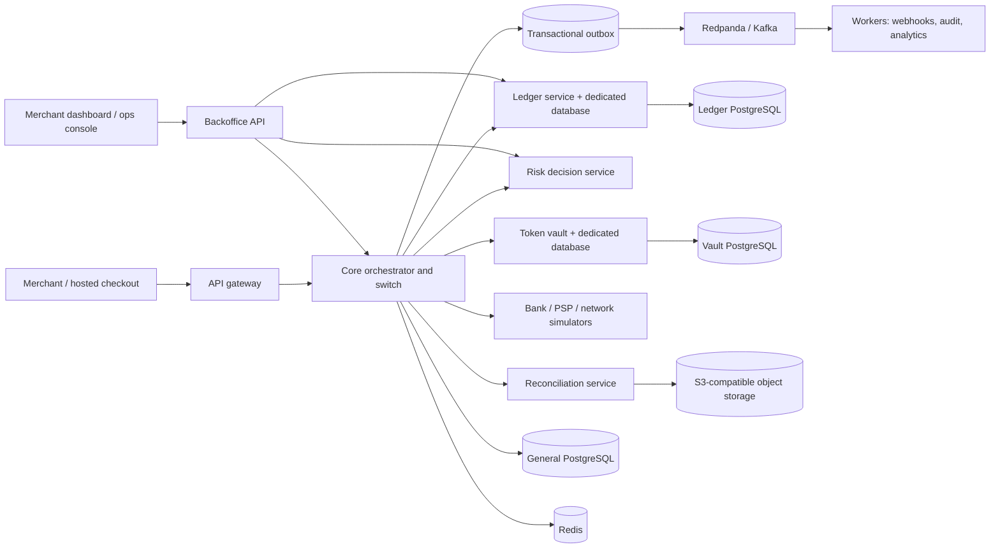

# Tally architecture

This is the target topology. The ledger service and its local API are implemented and independently stored in PostgreSQL. The other application boxes remain target components and are not implemented yet.

## Service boundaries

The intended design keeps the ledger and vault as separately permissioned services and databases. The core coordinates workflows and persists state but never edits ledger balances. It submits deterministic, idempotent posting requests to the ledger. This modular-core boundary keeps payment state transitions close together while preserving independent security and consistency boundaries for money and card tokens.

## Local dependencies

`docker compose up -d --wait` starts three PostgreSQL instances (general, ledger, vault), Redis 7, Redpanda, and SeaweedFS with its S3 endpoint. Credentials in Compose are local development values only and must never be reused outside local simulation.
